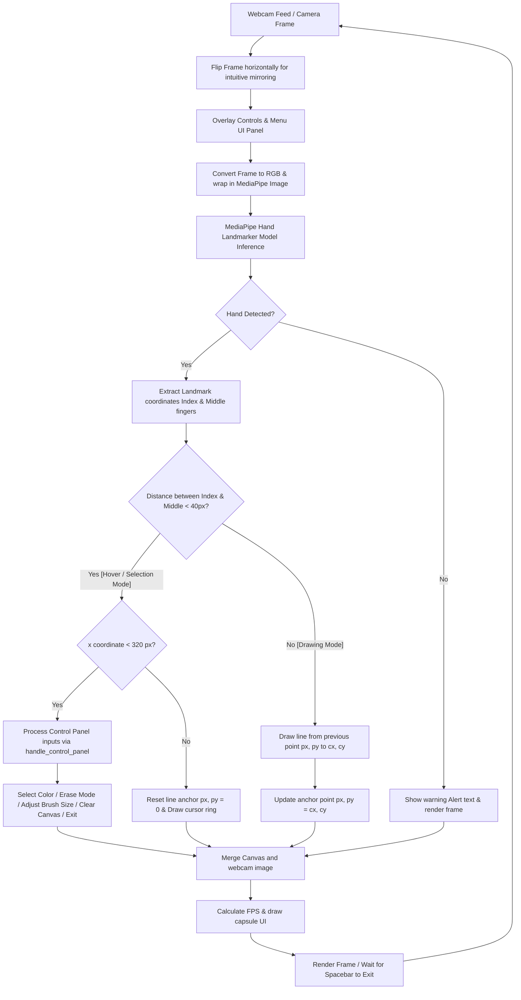

# 🎨 AirPaint: Finger Painter Computer Vision

AirPaint is a real-time, gesture-based digital canvas application powered by computer vision. Using your webcam, you can paint in the air, change colors, adjust brush thickness, use an eraser, or clear the canvas using simple hand movements and finger gestures.

---

## 🏗️ Architecture & Flow Scheme

The diagram below details the real-time processing pipeline, tracking landmarks, mode detection, canvas overlays, and system control steps:



---

## 📂 Directory Structure

Here is the structural layout of the project:

```text
Finger_Painter_Computer_Vision/
├── Hand_Tracking_Model/
│   ├── hand_landmarker.task       # MediaPipe pre-trained model file
│   ├── landmarks.png              # Landmarks visual helper
│   └── utils.py                   # Hand tracking wrapper class (handDetector)
├── controls.png                   # Left-side controls UI overlay texture
├── main.py                        # Main application run loop
├── readme.md                      # Documentation (This file)
├── requirements.txt               # Project dependencies
└── utils.py                       # Helper functions (FPS, selection handling, math)
```

---

## 📄 File Details

*   [main.py](file:///Users/wess/Desktop/computer%20vision/Finger_Painter_Computer_Vision/main.py): The main loop that reads frames from the camera, interfaces with the hand detector, manages state (active color, brush thickness, drawing state), merges the canvas overlay, and displays the graphical output.
*   [utils.py](file:///Users/wess/Desktop/computer%20vision/Finger_Painter_Computer_Vision/utils.py): Provides math utilities such as Euclidean distance calculations, FPS calculation/rendering, and the modular `handle_control_panel` function for processing hover selections.
*   [Hand_Tracking_Model/utils.py](file:///Users/wess/Desktop/computer%20vision/Finger_Painter_Computer_Vision/Hand_Tracking_Model/utils.py): Houses the `handDetector` class, which handles configuring and running the MediaPipe hand landmarker model in video mode.
*   [Hand_Tracking_Model/hand_landmarker.task](file:///Users/wess/Desktop/computer%20vision/Finger_Painter_Computer_Vision/Hand_Tracking_Model/hand_landmarker.task): The binary model bundle utilized by MediaPipe to detect and track 21 3D hand landmarks in real time.
*   [requirements.txt](file:///Users/wess/Desktop/computer%20vision/Finger_Painter_Computer_Vision/requirements.txt): Lists the Python packages required to build and run this application.

---

## 🧮 How It Works (Core Logic)

The core operations rely on key mathematical and coordinate checks:

### 1. Mode Detection
At each frame, the Euclidean distance between the tip of the **Index Finger** (Landmark 8) and the tip of the **Middle Finger** (Landmark 12) is calculated:
$$\text{Distance} = \sqrt{(x_{\text{index}} - x_{\text{middle}})^2 + (y_{\text{index}} - y_{\text{middle}})^2}$$

*   **Selection Mode (Distance < 40 pixels):** When the fingers are pinched together, drawing is paused. This allows the user to hover and select colors/tools or move the cursor without painting.
*   **Drawing Mode (Distance $\ge$ 40 pixels):** When the fingers are separated, the application draws lines on a separate black `canvas` image mask between the current index finger position $(cx, cy)$ and the previous position $(px, py)$.

### 2. Control Panel Interaction
When in **Selection Mode**, if the cursor's $x$-coordinate is less than 320 px (within the sidebar menu), the program matches the $y$-coordinate against specific row ranges to select colors or activate actions:
*   **Row 1 ($180 < y < 250$):** Select colors (Red, Green, Blue, Yellow).
*   **Row 2 ($300 < y < 370$):** Select colors (Purple, Orange, White, Black).
*   **Row 3 ($425 < y < 525$):** Increase/decrease brush thickness, clear the canvas, or activate Eraser mode.
*   **Row 4 ($580 < y < 680$):** Safely exits the application.

---

## 🛠️ Setup & Requirements

### Dependencies
Ensure you have Python 3.9+ installed. The dependencies are:
*   `opencv-python`
*   `mediapipe`
*   `numpy`

### Step-by-Step Installation

1.  **Clone or Open the Project directory:**
    ```bash
    cd "/Users/wess/Desktop/computer vision/Finger_Painter_Computer_Vision"
    ```

2.  **Create and Activate a Virtual Environment:**
    ```bash
    # Create the environment
    python3 -m venv .venv

    # Activate the environment
    source .venv/bin/activate
    ```

3.  **Install dependencies:**
    ```bash
    pip install --upgrade pip
    pip install -r requirements.txt
    ```

4.  **Run the application:**
    ```bash
    python main.py
    ```

---

## 🎮 Controls & Usage

*   **Move & Select (Hover Mode):** Pinched fingers (Index + Middle finger tips close together). Use this mode to select colors or options on the left-side control panel.
*   **Draw (Drawing Mode):** Separate your index and middle fingers. The drawing follows your index fingertip.
*   **Erase:** Hover over the eraser icon in the controls panel to switch the brush to black with a larger radius.
*   **Clear Canvas:** Hover over the clear button to reset the drawing board.
*   **Quit application:**
    *   Press the **Spacebar** on your keyboard while the window is active.
    *   Or hover over the **Exit** zone on the bottom of the left control panel.
